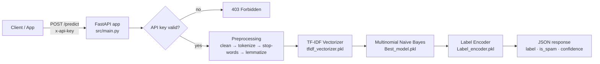

<div align="center">

# 📩 Spam or Ham — SMS Classification API

**A production-style machine-learning microservice that classifies SMS messages as _spam_ or _ham_ using a lightweight CPU-based inference pipeline.**
NLP preprocessing → TF-IDF → Multinomial Naive Bayes, served with FastAPI, secured with API-key auth, containerized with Docker and deployed on Blitz.cloud.


</div>

---

## Table of Contents

1. [Overview](#1-overview)
2. [Key Features](#2-key-features)
3. [Architecture](#3-architecture)
4. [The ML Pipeline](#4-the-ml-pipeline)
5. [Model Performance](#5-model-performance)
6. [API Reference](#6-api-reference)
7. [Project Structure](#7-project-structure)
8. [Configuration](#8-configuration)
9. [Getting Started (Local)](#9-getting-started-local)
10. [Retraining the Model](#10-retraining-the-model)
11. [Docker](#11-docker)
12. [Deploying to Blitz.cloud](#12-deploying-to-blitzcloud)
13. [Design Decisions](#13-design-decisions)
14. [Limitations & Roadmap](#14-limitations--roadmap)
15. [Author](#15-author)

---

## 1. Overview

Unsolicited SMS (phishing links, fake prizes, premium-rate scams) is a real problem, and it is a textbook use case for text classification. This project takes the problem all the way from **raw data to a deployed service**, not just a notebook:

- an exploratory notebook comparing four classical models,
- a reproducible training script that exports versioned artifacts,
- a typed, documented REST API that loads those artifacts once at startup,
- a Docker image and a Blitz.cloud deployment so anyone can call it over HTTP.

> **Live API docs (Swagger UI):** `https://spam-or-ham-api.muhammed.blitz.cloud/docs`

---

## 2. Key Features

| | |
|---|---|
| ⚡ **Fast inference** | Preprocessing + vectorization + prediction using a lightweight CPU-based inference pipeline. Artifacts are loaded once at startup, not per request. |
| 🎯 **Precision-first model** | **0 false positives** on the held-out test set — legitimate messages are never flagged as spam (see [Model Performance](#5-model-performance)). |
| 🔐 **API-key authentication** | `POST` endpoints require an `x-api-key` header. The key lives in an environment variable, never in the image or the repo. |
| 📦 **Single + batch prediction** | Classify one message or up to **150 messages** in one call. |
| 🧾 **Typed contracts** | Pydantic request/response models give automatic validation and an interactive OpenAPI schema at `/docs`. |
| 🩺 **Health endpoint** | `/health` reports service status, model-loaded flag and version — ready for cloud/container health probes. |
| 🐳 **Container-ready** | Slim Python 3.11 image, NLTK data baked in at build time, non-root user, honors the platform's `$PORT`. |
| ⚙️ **12-factor config** | All settings via environment variables (`pydantic-settings`), with sensible defaults. |

---

## 3. Architecture



**Request lifecycle**

1. FastAPI receives the request and validates the body against a Pydantic schema.
2. The `x-api-key` dependency checks the key against `settings.API_KEY`.
3. The text goes through the **exact same preprocessing function used at training time** (`src/preprocessing.py`) — this prevents training/serving skew.
4. The fitted TF-IDF vectorizer turns it into a sparse feature vector.
5. The classifier returns a class and class probabilities; the label encoder maps the class back to `"spam"` / `"ham"`.
6. The response contains the label, a boolean flag and the model's confidence.

---

## 4. The ML Pipeline

### Dataset

The [SMS Spam Collection](https://archive.ics.uci.edu/dataset/228/sms+spam+collection) — **5,572** labeled English SMS messages.

| Class | Messages | Share |
|---|---:|---:|
| ham | 4,825 | 86.6 % |
| spam | 747 | 13.4 % |

The dataset is **imbalanced**, which is why accuracy alone is a misleading metric here and the project reports precision, recall and F1 for the spam class.

### Preprocessing (`src/preprocessing.py`)

| Step | What happens | Example |
|---|---|---|
| 1. Clean | Remove every non-alphabetic character, lowercase, collapse whitespace | `"WINNER!! Call 0906…"` → `"winner call"` |
| 2. Tokenize | `nltk.word_tokenize` | `"winner call"` → `["winner", "call"]` |
| 3. Stop-word removal | Drop English stop-words | removes _the, is, to, …_ |
| 4. Lemmatize | WordNet lemmatizer (verb mode) | _winning → win_ |

### Feature extraction & model

- **TF-IDF** (unigrams, **5,870**-term vocabulary) fitted **on the training split only** to avoid data leakage.
- **Multinomial Naive Bayes** (`alpha=1.0`) — a strong, fast baseline for sparse text features.
- **Label encoding:** `ham → 0`, `spam → 1`.
- Split: random **80 / 20** train/test (`random_state=42`).

### Model comparison (exploratory notebook)

Four classifiers were benchmarked in `notebooks/notebook.ipynb` (10-fold CV accuracy on the training set, spam-class metrics on the test set):

| Model | CV accuracy | Precision | Recall | F1 |
|---|---:|---:|---:|---:|
| Multinomial NB | 0.966 | 0.991 | 0.733 | 0.843 |
| Random Forest | 0.977 | 1.000 | 0.840 | 0.913 |
| SVC | 0.976 | 0.992 | 0.833 | 0.906 |
| KNN | 0.915 | 1.000 | 0.400 | 0.571 |

The service ships Naive Bayes — see [Design Decisions](#13-design-decisions) for the trade-off, and the [Roadmap](#14-limitations--roadmap) for how recall can be pushed higher.

---

## 5. Model Performance

Metrics of the **deployed artifacts** (`models/*.pkl`), evaluated on the held-out test split (1,115 messages, 150 of them spam):

| Metric (spam class) | Score |
|---|---:|
| **Precision** | **1.000** |
| **Recall** | 0.740 |
| **F1** | 0.851 |
| **Accuracy** | 0.965 |
| **ROC-AUC** | 0.981 |

**Confusion matrix**

|  | Predicted ham | Predicted spam |
|---|---:|---:|
| **Actual ham** | 965 | **0** |
| **Actual spam** | 39 | 111 |

**How to read this:** the model never blocked a legitimate message (0 false positives) and catches roughly three out of four spam messages. In a messaging product, wrongly hiding a real message is usually costlier than letting an occasional spam through, so this precision-first profile is a deliberate and defensible default.

---

## 6. API Reference

- **Base URL (local):** `http://127.0.0.1:8000`
- **Base URL (deployed):** `https://spam-or-ham-api.muhammed.blitz.cloud`
- **Swagger UI:** `https://spam-or-ham-api.muhammed.blitz.cloud/docs`
- **Health:** `https://spam-or-ham-api.muhammed.blitz.cloud/health`

Interactive docs are available at **`/docs`** (Swagger) and **`/redoc`** on both.

| Method | Endpoint | Auth | Description |
|---|---|:---:|---|
| `GET` | `/` | – | Service banner and links |
| `GET` | `/health` | – | Liveness / readiness probe |
| `POST` | `/predict` | 🔑 | Classify a single message |
| `POST` | `/predict/batch` | 🔑 | Classify 1–150 messages |

Authentication is done with the header **`x-api-key: <your key>`**.

### `GET /health`

```bash
curl https://spam-or-ham-api.muhammed.blitz.cloud/health
```
```json
{ "status": "ok", "model_loaded": true, "app_version": "1.0.0" }
```

### `POST /predict`

```bash
curl -X POST https://spam-or-ham-api.muhammed.blitz.cloud/predict \
  -H "Content-Type: application/json" \
  -H "x-api-key: $API_KEY" \
  -d '{"text": "WINNER!! You have won a free prize. Call 09061701461 now to claim your cash reward"}'
```
```json
{ "label": "spam", "is_spam": true, "confidence": 0.9749 }
```

```bash
curl -X POST https://spam-or-ham-api.muhammed.blitz.cloud/predict \
  -H "Content-Type: application/json" \
  -H "x-api-key: $API_KEY" \
  -d '{"text": "Hey are we still meeting for lunch tomorrow?"}'
```
```json
{ "label": "ham", "is_spam": false, "confidence": 0.9986 }
```

### `POST /predict/batch`

```bash
curl -X POST https://spam-or-ham-api.muhammed.blitz.cloud/predict/batch \
  -H "Content-Type: application/json" \
  -H "x-api-key: $API_KEY" \
  -d '{"texts": ["Free entry in a weekly competition, text WIN to 80086", "ok see you at home"]}'
```
```json
{
  "results": [
    { "label": "spam", "is_spam": true,  "confidence": 0.8779 },
    { "label": "ham",  "is_spam": false, "confidence": 0.9982 }
  ]
}
```
Results are returned **in the same order** as the input list.

### Python client

```python
import requests

resp = requests.post(
    "https://spam-or-ham-api.muhammed.blitz.cloud/predict",
    headers={"x-api-key": "YOUR_API_KEY"},
    json={"text": "Congratulations! You've been selected for a free iPhone. Click now."},
    timeout=10,
)
resp.raise_for_status()
print(resp.json())   # {'label': 'spam', 'is_spam': True, 'confidence': ...}
```

### Response fields

| Field | Type | Meaning |
|---|---|---|
| `label` | `"spam"` \| `"ham"` | Predicted class |
| `is_spam` | `bool` | Convenience flag |
| `confidence` | `float` (0–1) | Probability of the predicted class (rounded to 4 decimals) |

### Status codes

| Code | When |
|---|---|
| `200` | Success |
| `403` | Missing or invalid `x-api-key` |
| `422` | Malformed body (e.g. missing `text`, empty list, or more than 150 messages in a batch) |
| `500` | Unexpected inference failure (logged server-side with stack trace) |

---

## 7. Project Structure

```
spam-or-ham/
├── src/
│   ├── main.py             # FastAPI app: routes, CORS, API-key dependency
│   ├── config.py           # Typed settings (pydantic-settings), artifact paths
│   ├── inference.py        # SpamClassifier: loads artifacts once, predict()
│   ├── preprocessing.py    # Shared text pipeline (used by training AND serving)
│   ├── request.py          # Pydantic request schemas
│   └── response.py         # Pydantic response schemas
├── models/
│   ├── Best_model.pkl      # Trained Multinomial Naive Bayes
│   ├── tfidf_vectorizer.pkl
│   └── Label_encoder.pkl
├── dataset/
│   └── spam.csv            # SMS Spam Collection
├── notebooks/
│   └── notebook.ipynb      # EDA + model comparison
├── train.py                # Reproducible training → writes models/*.pkl
├── app.py                  # Local dev runner (uvicorn with reload)
├── Dockerfile
├── .dockerignore
├── requirements.txt
├── .env.example
└── README.md
```

**Separation of concerns:** `preprocessing.py` is imported by both `train.py` and `inference.py`, so the transformation applied at training time is guaranteed to be identical to the one applied in production.

---

## 8. Configuration

All configuration is read from environment variables (or a local `.env` file) via `pydantic-settings`.

| Variable | Required | Default | Description |
|---|:---:|---|---|
| `API_KEY` | ✅ | – | Secret expected in the `x-api-key` header |
| `APP_NAME` | – | `Spam or Ham SMS Classifier API` | Title shown in the OpenAPI docs |
| `APP_VERSION` | – | `1.0.0` | Version reported by `/health` and the docs |
| `MODEL_PATH` | – | `models/Best_model.pkl` | Path to the classifier |
| `TFIDF_VECTORIZER_PATH` | – | `models/tfidf_vectorizer.pkl` | Path to the vectorizer |
| `LABEL_ENCODER_PATH` | – | `models/Label_encoder.pkl` | Path to the label encoder |
| `PORT` | – | `8000` (container) | Provided by the hosting platform |
| `NLTK_DATA` | – | set in Dockerfile | Where NLTK corpora are stored |

> 🔒 **Never commit `.env`.** It is already in `.gitignore` and `.dockerignore`. On Blitz.cloud, set `API_KEY` as an environment variable/secret in the service settings.

Example local `.env`:

```env
API_KEY=change-me-to-a-long-random-string
APP_NAME="Spam or Ham SMS Classifier API"
APP_VERSION="1.0.0"
```

Generate a strong key with: `python -c "import secrets; print(secrets.token_urlsafe(32))"`

---

## 9. Getting Started (Local)

**Prerequisites:** Python **3.11** (the pickled models were trained with scikit-learn 1.6.0 — keep the pinned versions).

```bash
# 1. Clone
git clone https://github.com/muhammeedd1/Spam-or-Ham-SMS-Classifier-API.git
cd Spam-or-Ham-SMS-Classifier-API

# 2. Create and activate a virtual environment
python -m venv .venv
source .venv/bin/activate          # Windows: .venv\Scripts\activate

# 3. Install dependencies
pip install -r requirements.txt

# 4. Configure
echo "API_KEY=dev-secret-key" > .env

# 5. Run (auto-reload)
python app.py
# or: uvicorn src.main:app --reload
```

Open **http://127.0.0.1:8000/docs**, click **Authorize**, paste your API key and try the endpoints from the browser.

> On first run NLTK downloads its small corpora (punkt, stopwords, wordnet) automatically; later runs reuse them.

---

## 10. Retraining the Model

```bash
python train.py
```

The script will:

1. download the required NLTK resources,
2. load and clean `dataset/spam.csv`,
3. apply the shared `preprocess()` function,
4. split 80/20 (`random_state=42`), fit TF-IDF on the training split,
5. train Multinomial Naive Bayes and print accuracy / precision / recall / F1,
6. overwrite `models/tfidf_vectorizer.pkl`, `models/Best_model.pkl`, `models/Label_encoder.pkl`.

Restart the API afterwards so it picks up the new artifacts. If you upgrade `scikit-learn`, **retrain** — pickles are not guaranteed to be compatible across versions.

---

## 11. Docker

The image is built for small size, cache efficiency and safety:

- `python:3.11-slim` base (matches the training environment),
- dependencies installed **before** the source is copied → rebuilds are fast when only code changes,
- NLTK corpora downloaded **at build time** → no internet needed at runtime, no cold-start downloads,
- only `src/` and `models/` are copied (no dataset, notebooks or secrets),
- runs as a **non-root** user,
- binds to `0.0.0.0` and the platform-provided `$PORT`.

```bash
# Build
docker build -t spam-or-ham .

# Run (the key is passed at runtime, never baked into the image)
docker run --rm -p 8000:8000 -e API_KEY=dev-secret-key spam-or-ham

# Check
curl http://localhost:8000/health
```

Locally the container listens on port `8000` (the fallback when `PORT` is not set); on Blitz.cloud it listens on the platform-provided `PORT`.

---

## 12. Deploying to Blitz.cloud

The service is currently deployed on Blitz.cloud and publicly accessible:

- **Base URL:** `https://spam-or-ham-api.muhammed.blitz.cloud`
- **Swagger UI:** `https://spam-or-ham-api.muhammed.blitz.cloud/docs`
- **Health:** `https://spam-or-ham-api.muhammed.blitz.cloud/health`

**Deployment workflow**

1. Push the project to GitHub (make sure `.env` is **not** committed).
2. Connect the GitHub repository to Blitz.cloud.
3. Select the `main` branch.
4. Blitz detects the `Dockerfile` — keep it as the build/runtime configuration (runtime: Docker).
5. Add `API_KEY` as an environment variable/secret in the service settings.
6. Deploy. Blitz builds the Docker image and starts the service, which listens on the platform-provided `$PORT`.

**Continuous deployment:** every new push to `main` triggers a new deployment automatically. The service uses no database.

**Verify the deployment**

```bash
curl https://spam-or-ham-api.muhammed.blitz.cloud/health
```
```json
{ "status": "ok", "model_loaded": true, "app_version": "1.0.0" }
```

Then open **`https://spam-or-ham-api.muhammed.blitz.cloud/docs`** for the Swagger UI. `/health` and `/docs` are public; `/predict` and `/predict/batch` require the `x-api-key` header:

```bash
curl -X POST https://spam-or-ham-api.muhammed.blitz.cloud/predict \
  -H "Content-Type: application/json" \
  -H "x-api-key: $API_KEY" \
  -d '{"text": "URGENT! Your account has been suspended. Verify now."}'
```

---

## 13. Design Decisions

| Decision | Why |
|---|---|
| **Multinomial Naive Bayes over heavier models** | Lightweight artifact, lightweight CPU inference, trivially cheap to host on a free tier, and **zero false positives** on the held-out set. Random Forest and SVC reach ~0.83–0.84 recall in the notebook, so the trade-off is deliberate: lowest serving cost and a precision-first profile versus ~10 points of recall. |
| **Shared `preprocess()` for train & serve** | Eliminates training/serving skew — the most common silent failure in deployed NLP systems. |
| **TF-IDF fitted on the training split only** | Prevents test-set information from leaking into the vocabulary and IDF weights, keeping reported metrics honest. |
| **Model loaded once at import time** | No per-request disk I/O; startup fails fast with a clear message if an artifact is missing. |
| **Sync endpoints for CPU-bound work** | Inference is CPU-bound; FastAPI runs sync handlers in a thread pool, so the event loop is never blocked. |
| **`x-api-key` header auth** | Simple, stateless and enough to stop casual abuse of a public demo; keeps the secret in the environment. |
| **Typed settings via `pydantic-settings`** | One place for configuration, validated at startup, overridable per environment. |
| **NLTK data baked into the image** | Deterministic builds and no runtime dependency on external download servers. |

---

## 14. Limitations & Roadmap

**Known limitations**

- **English only**, trained on a classic SMS corpus — modern phishing, URLs/shortlinks and non-English messages are out of distribution.
- **Recall is 0.74** at the default 0.5 decision threshold: about 1 in 4 spam messages in the test set is missed.
- Preprocessing removes digits and symbols, so signals like phone numbers, currency symbols or URL patterns are discarded.
- CORS is open (`*`) for ease of demoing; restrict `allow_origins` for a real front-end.
- Authentication is a single shared key — there are no per-client quotas or rate limits.

**Roadmap**

- [ ] Tune the decision threshold / class weights to trade precision for higher recall; expose it as a setting.
- [ ] Evaluate calibrated SVC / Random Forest / Logistic Regression and char-level n-grams against the current baseline.
- [ ] Stratified split + cross-validated reporting in `train.py`; log metrics to a `metrics.json` artifact.
- [ ] Hand-crafted features (message length, digit ratio, URL / currency presence).
- [ ] Stricter request validation (text length bounds, whitespace-only rejection).
- [ ] Automated tests (`pytest` + FastAPI `TestClient`) and a GitHub Actions CI pipeline that builds the Docker image.
- [ ] Rate limiting, structured JSON logging and Prometheus metrics.
- [ ] Model versioning and a `/model-info` endpoint.

---

## 15. Author

**Muhammed Hussien** — AI student (Intelligent Systems), College of Artificial Intelligence, Menoufia University · Class of 2027 · Focused on Edge & Embedded AI.

- GitHub: [@muhammeedd1](https://github.com/muhammeedd1)
- LinkedIn: [muhammed-hussien](https://www.linkedin.com/in/muhammed-hussien-a0a426333)

If you find this project useful, a ⭐ on the repo is appreciated.

---

<div align="center">
<sub>Built with FastAPI, scikit-learn and NLTK · Dataset: UCI SMS Spam Collection</sub>
</div>
